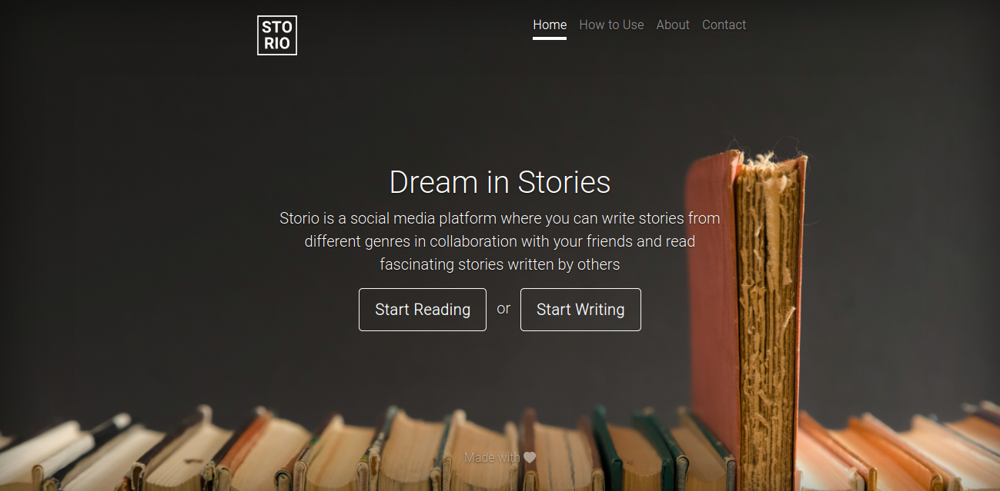
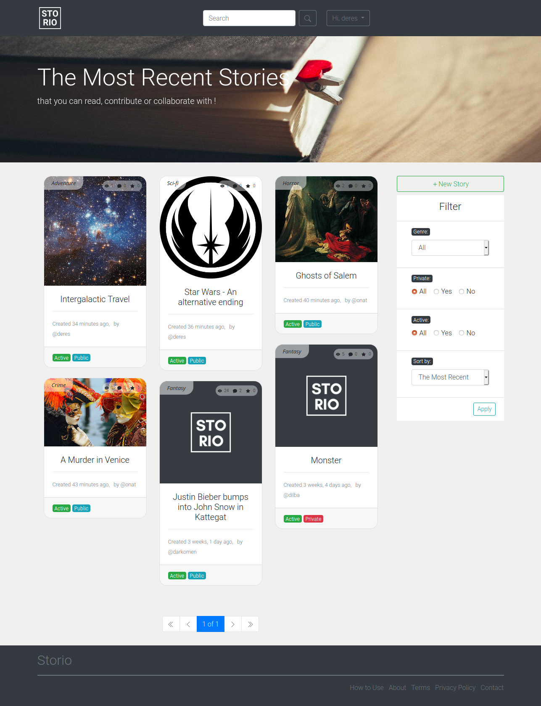
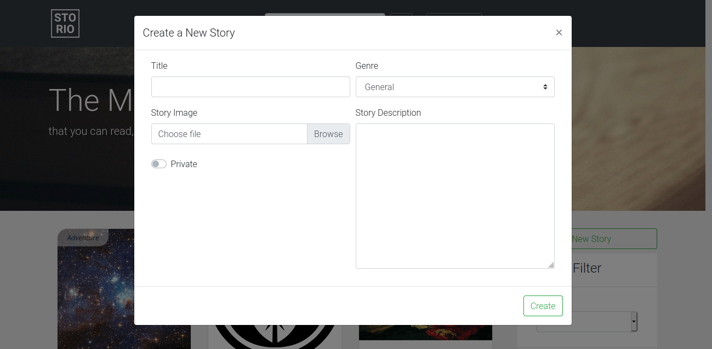
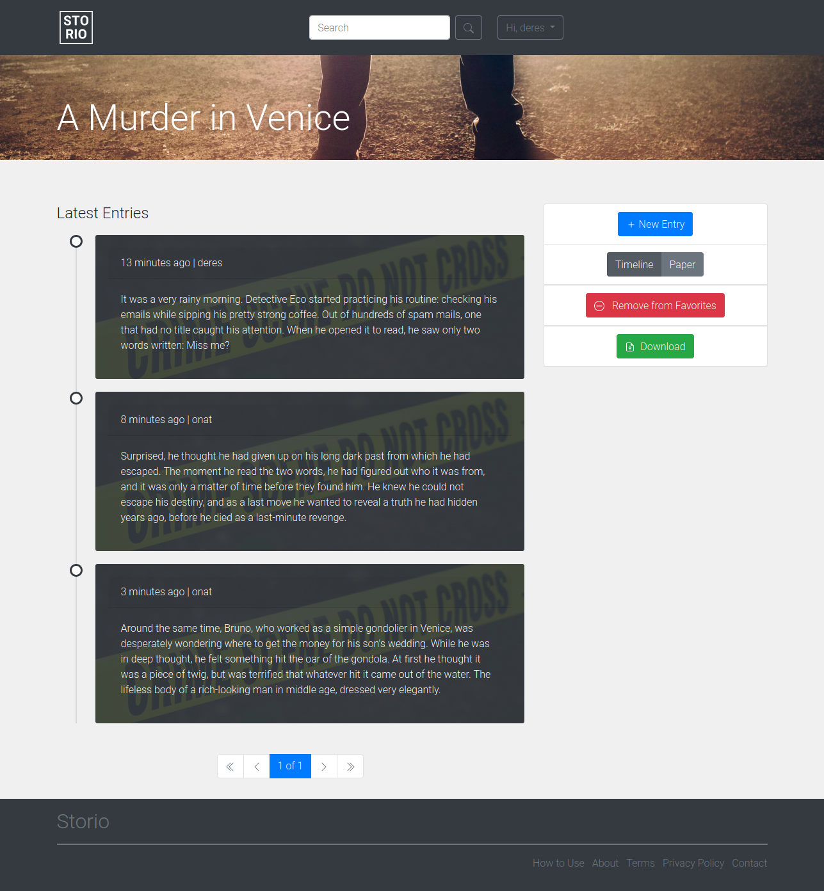
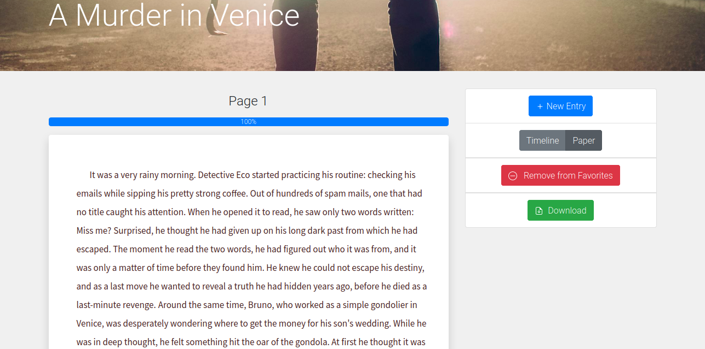
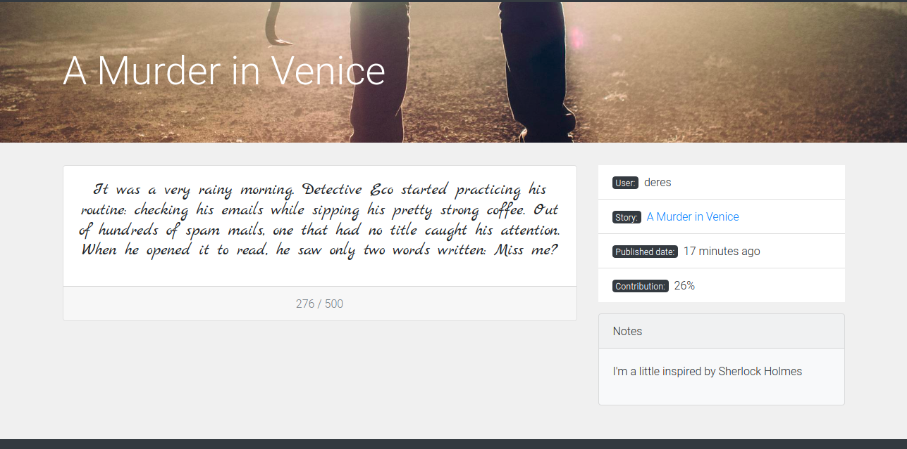
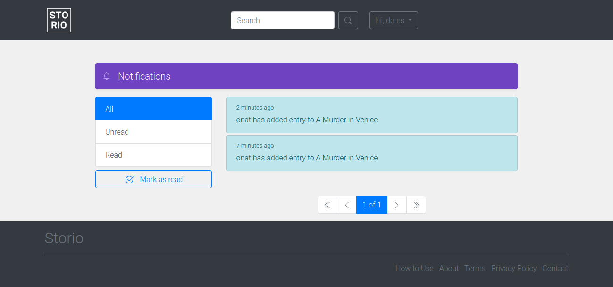
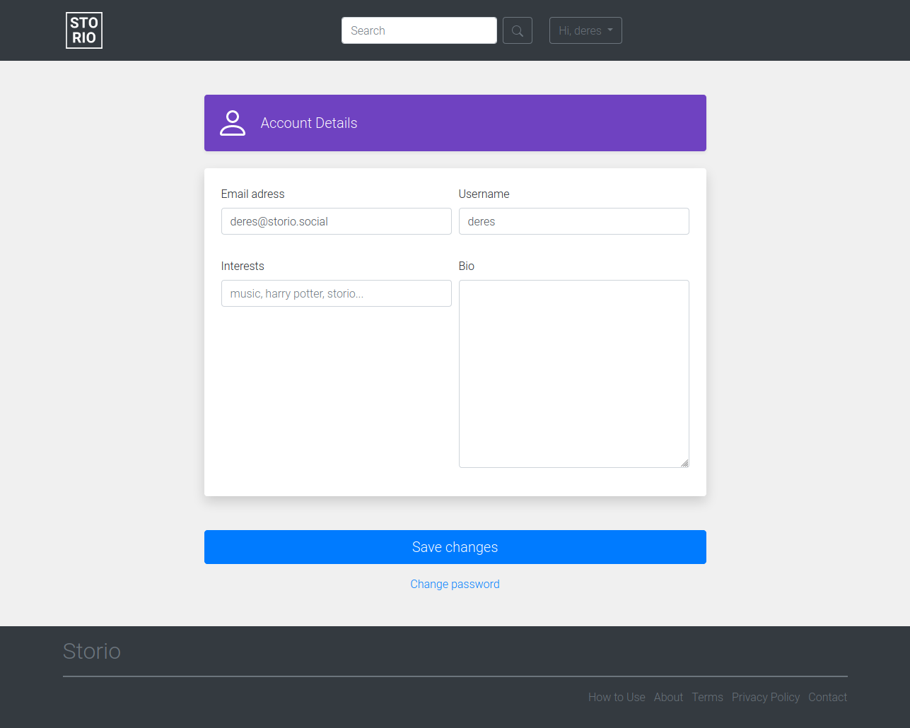

What is Storio ?
----------------
I like stories, both reading and writing them. Well, I thought it would be nice to have a platform where I can write stories together with my friends and complement each other's stories. The nice thing is that you never know where and how the story will end, as everyone completes each other's paragraphs. You start the story as a robot on a distant planet, at the end of the story you find yourself murdered while hanging out with Di Caprio in Times Square.

Some screenshots
----------------

#### Landing Page

#### Gallery

#### New Story

#### Timeline Style Story Detail

#### Paper Style Story Detail

#### Entry Detail

#### Notifications

#### Account Settings

